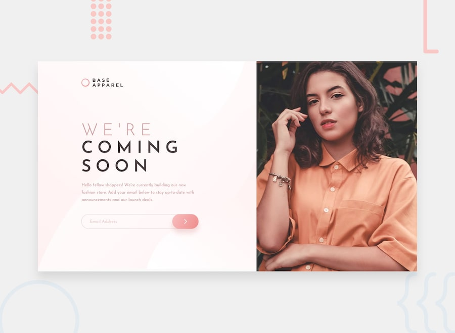

# Frontend Mentor - Base Apparel coming soon page

## Welcome! 👋

Thanks for checking out this front-end coding challenge.

[Frontend Mentor](https://www.frontendmentor.io) challenges allow you to improve your skills in a real-life workflow.

**To do this challenge, you need a basic understanding of HTML, CSS and JavaScript.**

## The challenge

Your challenge is to build out this coming soon page and get it looking as close to the design as possible.

You can use any tools you like to help you complete the challenge. So if you've got something you'd like to practice, feel free to give it a go.

Your users should be able to:

- View the optimal layout for the site depending on their device's screen size
- See hover states for all interactive elements on the page
- Receive an error message when the `form` is submitted if:
  - The `input` field is empty
  - The email address is not formatted correctly

Want some support on the challenge? [Join our Slack community](https://www.frontendmentor.io/slack) and ask questions in the **#help** channel.

## Where to find everything

Your task is to build out the project to the designs inside the `/design` folder. You will find both a mobile and a desktop version of the design to work to. 

The designs are in JPG static format. This will mean that you'll need to use your best judgment for styles such as `font-size`, `padding` and `margin`. This should help train your eye to perceive differences in spacings and sizes.

If you would like the Sketch file in order to inspect the design in more detail it is available to [purchase here](https://bmc.xyz/l/Pn38ZJp61).

You will find all the required assets in the `/images` folder. The assets are already optimized.

There is also a `style-guide.md` file, which contains the information you'll need, such as color palette and fonts.

## Building your project

Feel free to use any workflow that you feel comfortable with. Below is a suggested process, but do not feel like you need to follow these steps:

1. Initialize your project as a public repository on [GitHub](https://github.com/). This will make it easier to share your code with the community if you need some help. If you're not sure how to do this, [have a read through of this Try Git resource](https://try.github.io/).
2. Configure your repository to publish your code to a URL. This will also be useful if you need some help during a challenge as you can share the URL for your project with your repo URL. There are a number of ways to do this, but we recommend using [ZEIT Now](http://bit.ly/fem-zeit). We've got more information about deploying your project with ZEIT below.
3. Look through the designs to start planning out how you'll tackle the project. This step is crucial to help you think ahead for CSS classes that you could create to make reusable styles.
4. Before adding any styles, structure your content with HTML. Writing your HTML first can help focus your attention on creating well-structured content.
5. Write out the base styles for your project, including general content styles, such as `font-family` and `font-size`.
6. Start adding styles to the top of the page and work down. Only move on to the next section once you're happy you've completed the area you're working on.
7. If you'd like to try making your project fully responsive, we'd recommend checking out [Sizzy](http://bit.ly/fem-sizzy). It's a great browser that makes it easy to view your site across multiple devices.

## Deploying your project

As mentioned above, there are a number of ways to host your project for free. We recommend using [ZEIT Now](http://bit.ly/fem-zeit) as it's an amazing service and extremely simple to get set up with. If you'd like to use ZEIT, here are some steps to follow to get started:

1. [Sign up to ZEIT Now](http://bit.ly/fem-zeit-signup) and go through the onboarding flow, ensuring your GitHub account is connected by using their [ZEIT Now for GitHub](https://zeit.co/docs/v2/git-integrations/zeit-now-for-github) integration.
2. Connect your project to ZEIT Now from the ["Create a new project" page](https://zeit.co/new), using the "New Project From GitHub" button and selecting the project you want to deploy.
3. Once connected, every time you `git push`, ZEIT Now will create a new [deployment](https://zeit.co/docs/v2/platform/deployments) and the deployment URL will be shown on your [ZEIT Dashboard](https://zeit.co/dashboard). You will also receive an email for each deployment with the URL.

## Sharing your solution

There are multiple places you can share your solution:

1. Submit it on the platform so that other users will see your solution on the site. Other users will be able to give you feedback, which could help improve your code for the next project.
2. Share your repository and live URL in the **#finished-projects** channel of the [Slack community](https://www.frontendmentor.io/slack).
3. Tweet [@frontendmentor](https://twitter.com/frontendmentor) and mention **@frontendmentor** including the repo and live URLs in the tweet. We'd love to take a look at what you've built and help share it around.

## Giving feedback

Feedback is always welcome, so if you have any to give on this challenge please email hi[at]frontendmentor[dot]io.

This challenge is completely free. Please share it with anyone who will find it useful for practice.

**Have fun building!** 🚀
